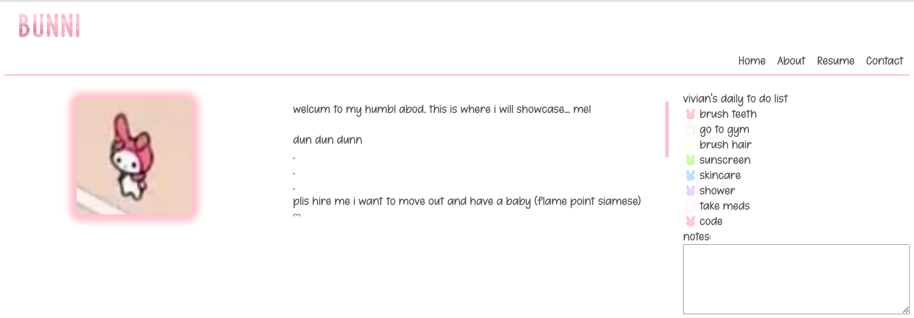

## Vivian Le Website

A website page for Vivian Le's portfolio, resume and other things.

## Author

[Vivian Le](https://www.linkedin.com/in/vivian-le-13a122195/)

## Github repo

This is the [link](https://github.com/17vle3/website) to the Github repo of the project

## Tech Stack

**Client:** HTML, CSS, JavaScript

## Tools Used

The list of tools used are linked at the bottom of the index page.

## Folder Structure

The index.html and readme files are in the root folder, alongside the screenshot included in the readme.

The assets folder contains the CSS and JavaScript files, all images and icons used, in their respective folders.

